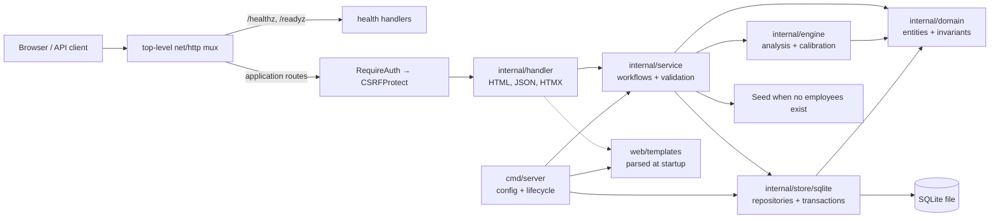

# Estimulos & Incentivos

A deliberately small, single-operator Go application for human-capital analysis and behavioral
intervention management. It combines MAP profiles with the Fogg behavior model (`B = M × A × P`)
to help an operator review employees, manage incentives and nudges, and apply calibrated stimuli.

**Portfolio focus:** this project demonstrates how a stateful web application can make data
integrity, operator security, deterministic template rendering, health checks, and reproducible
local/container delivery explicit—without pretending to be an enterprise HR platform.

> **Scope at a glance:** one trusted operator, one instance, one SQLite database. SSO, multi-tenant
> isolation, multi-role RBAC, and external integrations are intentionally out of scope.

## Quick demo

### Prerequisites

- Go 1.26.2, as declared in `go.mod`.
- Docker Engine with the `docker compose` plugin for the container path (optional).
- `curl` for the health-check smoke test (optional).
- No external database: SQLite is embedded in the application.

### Local path

From the repository root, copy the documented local-demo values and load them into the shell:

```bash
cp .env.example .env
set -a
. ./.env
set +a
go run ./cmd/server
```

This local path uses plain HTTP, so `.env.example` sets `COOKIE_SECURE=false`; its credentials are
clearly marked development-only examples and must be replaced before production-like use. Note
that `.env.example` is intentionally not tracked in this repository; the documented demo values
below are the complete set needed for the local path.

Then:

1. Open <http://localhost:8080>.
2. Sign in with the development defaults: user `admin`, password
   `dev-admin-password-change-me`.
3. Review the dashboard, employee list, incentives, nudges, and stimuli pages.
4. Use **Recommend** from an employee row when you want to create a recommended stimulus;
   applying a pending stimulus records the response and recalibrates its threshold atomically.
5. Verify the process is alive with `curl http://localhost:8080/healthz` → `ok` and ready with
   `curl http://localhost:8080/readyz` → `ready`.

The development defaults are intentionally visible and trigger a startup warning. Set
`OPERATOR_USER`, `OPERATOR_PASSWORD`, and `SESSION_SECRET` before any production-like deployment.

### Container path

```bash
docker compose up --build
```

Open <http://localhost:8080>. Compose runs one `app` service, stores SQLite at
`/data/estimulos.db`, mounts the named volume `estimulos-data:/data`, and waits on `/readyz` for
its healthcheck. The compose file sets `COOKIE_SECURE=false` because its demo endpoint is plain
HTTP; keep secure cookies enabled behind TLS.

Stop the demo with `docker compose down`. Remove the named volume only when an intentional demo
reset is required.

## Architecture

The application is a Go `net/http` service with server-rendered HTML, HTMX partials, and JSON API
handlers. The dependency direction in the source is:

| Package | Responsibility |
|---------|----------------|
| `cmd/server` | Environment configuration, startup ordering, signal handling, health wiring, and graceful shutdown. |
| `internal/handler` | HTTP routes, authentication/CSRF middleware, request mapping, HTML/JSON responses, and template execution. |
| `internal/service` | Application workflows, domain validation at workflow boundaries, seeding, recommendations, and stimulus application. |
| `internal/engine` | MAP/Fogg analysis, recommendation, risk calculation, and threshold calibration. |
| `internal/domain` | Entities, value ranges, enums, and pure behavioral invariants. |
| `internal/store/sqlite` | SQLite connections, embedded migrations, repositories, constraints, and transaction helpers. |
| `web/templates` | `html/template` pages and HTMX partials, parsed once during startup. |



At runtime, `cmd/server` opens and migrates SQLite, pings it, seeds a fresh database, loads the
operator configuration, resolves the application root, parses templates, registers routes, and
only then listens. Health probes bypass the application security chain; all other routes enter
`RequireAuth(CSRFProtect(...))` before reaching the handler layer.

## Production-hardening highlights

- **Integrity:** validated domain entities are backed by SQLite `CHECK`, `UNIQUE`, foreign-key,
  and cascade constraints.
- **Atomic workflows:** employee creation writes the employee, MAP profile, and threshold through
  one `Store.WithTx` transaction. Applying a stimulus transitions state, records history, and
  recalibrates the threshold in the same transaction.
- **Idempotency:** stimulus application uses a conditional pending-to-applied update. A repeat or
  concurrent loser returns a conflict without creating history side effects.
- **Operator security:** credentials are environment-configured; sessions are HMAC-signed and
  use `Secure`, `HttpOnly`, and `SameSite=Lax` cookie attributes. Mutating authenticated requests
  require a session-bound CSRF token.
- **Safe lifecycle:** invalid configuration, database, seed, or template failures stop startup
  before traffic is served. `/healthz`, `/readyz`, structured request logs, and bounded graceful
  shutdown make the single instance observable and operable.
- **Reproducible delivery:** the Docker build is multi-stage and CGO-free; CI runs the same test,
  build, vet, and format checks documented below.

The detailed as-built decisions are in
[`doc/design-production-hardening.md`](doc/design-production-hardening.md).

## Configuration

Configuration is supplied through environment variables. Invalid server/auth values fail startup
before the listener accepts traffic.

| Variable | Default | Purpose |
|----------|---------|---------|
| `PORT` | `8080` | HTTP port, validated from 1 to 65535. |
| `DB_PATH` | `estimulos.db` | SQLite database file. Compose uses `/data/estimulos.db`. |
| `APP_ROOT` | auto-detected | Directory containing `web/`; set it when running a binary outside the source layout or in a container. |
| `SHUTDOWN_TIMEOUT` | `15s` | Graceful-shutdown drain bound. |
| `OPERATOR_USER` | `admin` (development) | The single operator identity. |
| `OPERATOR_PASSWORD` | `dev-admin-password-change-me` (development) | Development password; replace it before production-like use. |
| `SESSION_SECRET` | development-only fallback | HMAC key for signed sessions; supplied values must be at least 16 characters. |
| `COOKIE_SECURE` | `true` | Cookie `Secure` flag. Set `false` only for a plain-HTTP local demo. |

The server logs a warning when development authentication defaults are active, but never logs the
credential or session-secret values.

## Persistence and backup

- SQLite uses the pure-Go `modernc.org/sqlite` driver, so the binary does not require CGO.
- The connection pool is intentionally limited to one connection. This is a single-process,
  single-instance design; multiple processes writing the same file are unsupported.
- Migrations are embedded in the binary and tracked in `schema_migrations`. The hardening migration
  rebuilds tables to add constraints and indexes while preserving valid rows; the department-target
  migration adds `nudges.target_depto` so department-scoped nudges can match by name.
- The container database is on the named volume `estimulos-data:/data` at
  `/data/estimulos.db`.
- The operator must **back up** the SQLite file or volume. Stop the instance before copying the
  file, or use `sqlite3 estimulos.db ".backup backup.db"` where the SQLite CLI is available.
- Back up before deploying a migration-bearing version. To restore, stop the instance, replace the
  database file, and start it again.

## Demo data and operator flow

On a fresh database, `Service.Seed` runs during startup only when no employees exist. The documented
demo dataset contains **(6 employees, 8 incentives, 8 nudges)**, including two department-scoped
nudges that demonstrate the `target_depto` matching against the employee's department. It is
deterministic and startup fails if seeding returns an error.

The main UI flow is:

1. Authenticate at `/login`.
2. Review analysis and risk information on `/`.
3. Inspect employees at `/empleados` and open a profile.
4. Use the recommendation action to create a calibrated stimulus when appropriate.
5. Review pending stimuli at `/estimulos` and apply one with a response in `[0,1]`.
6. Inspect incentives and nudges; the nudge list/detail templates are covered by render tests.

The employee list is also a deliberately testable portfolio detail: each row exposes exactly one
delete action through `hx-delete`, with confirmation and CSRF protection. Deleting an employee
cascades to its MAP profile, thresholds, stimuli, and stimulus history.

## HTTP surface

Health endpoints are public so local and container probes can use them:

| Method | Path | Meaning |
|--------|------|---------|
| `GET` | `/healthz` | Liveness: the process is alive → `ok`. |
| `GET` | `/readyz` | Readiness: templates are loaded and a bounded database ping succeeds → `ready`, otherwise `503 not ready`. |

The authenticated UI includes `/`, `/empleados`, `/empleados/{id}`, `/incentivos`,
`/incentivos/{id}`, `/nudges`, `/nudges/{id}`, and `/estimulos`. The API includes employee,
incentive, nudge, analysis, risk, recommendation, and stimulus resources; mutating API requests
require a valid session and CSRF token. The stimulus operation is
`POST /api/estimulos/{id}/aplicar`; the nudge toggle is `PUT /api/nudges/{id}/toggle`.

Templates are buffered before responses are written, so a render failure returns a generic `500`
without partial HTML. The current nudge card and detail templates render their real data, and the
render suite protects those paths; the toggle handler retains a JSON fallback if card rendering
fails.

## Verification

Run these commands from the repository root. They are the checks executed by CI:

```bash
go test ./... -count=1 -timeout 120s
go build ./...
go vet ./...
gofmt -l .
```

`gofmt -l .` must print nothing. For the repository-facing documentation contract specifically:

```bash
go test ./cmd/server -run 'TestDocsContract' -count=1
```

Runtime smoke checks, with the server already running:

```bash
curl -s http://localhost:8080/healthz
curl -s http://localhost:8080/readyz
```

Compose smoke check (requires Docker and curl):

```bash
./scripts/compose-smoke.sh
```

## Screenshots

No screenshot assets are currently checked into the repository. When adding portfolio screenshots,
use sanitized demo data, place reviewed PNG/WebP assets under a documented `docs/screenshots/`
location, and link them from this section instead of embedding missing files.

## Scope, limitations & non-goals

This is an explicit **out of scope** boundary, not a list of missing promises:

- **No SSO/OIDC** — one operator credential pair only.
- **No multi-tenant isolation** — one instance represents one organization.
- **No multi-role RBAC** — there is one operator identity, not an enterprise role model.
- **No external integrations** — no ERP, payroll, email, Slack, or other third-party adapters.
- **No background jobs** — workflows run in the request path or during startup.
- **No PostgreSQL** — SQLite is the supported database engine.
- **No Kubernetes** — Docker Compose is the single-instance demonstration path.
- **No analytics/ML** — analysis is descriptive and the Fogg calculation is deterministic.
- **No browser E2E suite** — current coverage is domain, store, service, handler `httptest`,
  template-render, delivery, lifecycle, and documentation-contract testing.

The accepted trust boundary is one trusted operator on a trusted host/network. This repository is
not a multi-tenant or multi-user security boundary.

## Known issues and accepted risks

- **Stateless sessions:** logout clears the browser cookie; a captured session token remains valid
  until its 24-hour TTL. Rotate `SESSION_SECRET` if compromise is suspected.
- **No login throttling:** brute-force protection and account lockout are out of scope for the
  single-operator deployment.
- **Single-instance SQLite:** one process and one connection are intentional; concurrent writers
  from multiple processes are unsupported.
- **Permanent employee deletion:** `DELETE /api/empleados/{id}` has no soft-delete or undo and
  cascades related records.
- **Plain-HTTP demos:** `COOKIE_SECURE=false` is acceptable only for the local Compose demo; use
  secure cookies behind TLS.

## Contributing and license

Keep contributions focused on the declared scope, preserve the single-instance assumptions, and
update the design note and documentation contract when behavior or operator guidance changes. Run
the verification commands before opening a pull request.

No `LICENSE` file is currently present, so this repository does not declare an open-source license.
Do not assume reuse rights; treat it as a private portfolio/internal demonstration unless the owner
adds explicit licensing terms.
