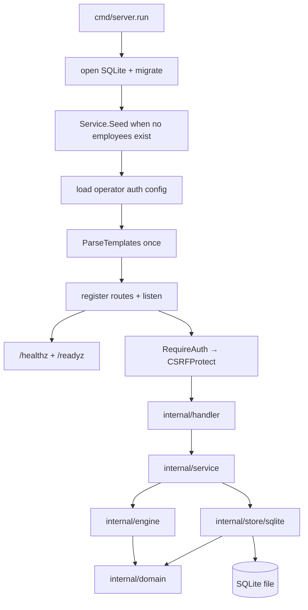

# Design — Production Hardening of the Estimulos & Incentivos MVP

Status: as-built reference · Scope: the hardened system currently present in this repository.

This document records the architectural decisions, integrity/security behavior, lifecycle,
delivery, and limitations of the current implementation. It is the detailed companion to the
[README](../README.md); the README is the operator-facing path, while this note explains why the
boundaries and hardening choices exist. The behavioral model is Fogg B = M × A × P with
psychophysical thresholds.

## 1. Architectural decisions

| # | Decision | Choice | Rejected | Rationale |
|---|----------|--------|----------|-----------|
| ADR-1 | Package boundaries | `cmd/server` wires startup; requests flow `handler → service`; `service` uses `domain`, `engine`, and `store/sqlite`; `engine` and `store/sqlite` depend on `domain` | Fat handlers, direct database access from handlers | The dependency direction keeps HTTP concerns at the edge, workflows in one place, and invariants reusable by the engine and persistence layer. |
| ADR-2 | Domain validation | `Validate() error` on `Empleado`, `PerfilMAP`, `Umbral`, and `Estimulo`; service workflows call it where those invariants apply, while SQLite remains the final boundary | Handler-only or SQL-only validation | One invariant source is reusable by workflows and tests; SQL `CHECK`/`UNIQUE` remain the final integrity boundary for out-of-band writes. |
| ADR-3 | Transactions | `Store.WithTx` owns begin/commit/rollback; workflow repository calls take `*sql.Tx` | Nested DB calls or callbacks using the pool | The original `CreateEmpleadoConPerfil` was falsely atomic (ignored the `tx` it received). One connection + one transaction = real atomicity. |
| ADR-4 | Stimulus idempotency | `ApplyEstimulo` runs `UPDATE ... WHERE estado='pendiente'`, checks `RowsAffected`, then history + recalibration in the same transaction; returns `ApplyResult{Applied, Conflict}` | Pre-read-then-update | The conditional transition is race-safe: a concurrent loser gets a deterministic `Conflict` and cannot create side effects. |
| ADR-5 | Operator security | Environment-configured single operator (`OPERATOR_USER`/`OPERATOR_PASSWORD`), `SESSION_SECRET`-signed sessions, `Secure`/`HttpOnly`/`SameSite=Lax` cookie, auth middleware, session-bound CSRF on mutations | Hardcoded secret, SSO/OIDC, multi-role RBAC | Fits the declared single-instance scope; secrets stay deploy-time configurable. |
| ADR-6 | Templates/lifecycle | Parse all templates once at startup from an explicit root (`APP_ROOT` or source-walk); `slog`; `/healthz` + `/readyz`; signal-driven bounded shutdown | Per-request `ParseFiles`, cwd-relative loading | Startup fails before traffic; rendering is deterministic and cwd-independent; probes and drain are explicit. |
| ADR-7 | Database engine | SQLite via `modernc.org/sqlite` (CGO-free), single pooled connection, `foreign_keys` pragma per connection | PostgreSQL, `database/sql` with a driver needing CGO | Pure-Go, portable, matches the MVP; single connection makes SQLite locking predictable. |
| ADR-8 | Migrations | Embedded SQL files in `internal/store/sqlite/migrations`, idempotent runner with `schema_migrations`, `PRAGMA foreign_key_check` gate | `golang-migrate` CLI | No external tooling; migrations travel with the binary; legacy DBs upgrade in place. |

### Runtime flow

Read the arrows below as calls or dependencies, not as deployment replicas. `cmd/server.run`
constructs the graph, prepares the database and templates, and starts one listener. Health probes
are deliberately outside the authenticated application mux; every other route enters the security
chain before reaching a handler.

## 2. Validation behavior

Validation lives in `internal/domain` and is applied at the service boundary for the workflows
that have explicit domain invariants. Employee creation, MAP profile updates, recommended stimuli,
and threshold recalibration are validated before their associated writes; auxiliary updates without
a domain `Validate` method remain bounded by their store and SQLite constraints.

| Entity | Invariants enforced |
|--------|---------------------|
| `Empleado` | non-empty `nombre`, `email` (must contain `@`), `cargo`, `departamento` |
| `PerfilMAP` | `empleado_id` > 0; `motivacion`/`habilidad`/`prompt`/`confiabilidad` ∈ [0,1]; `sensibilidad` ∈ {economico, reconocimiento, desarrollo, bienestar} |
| `Umbral` | `empleado_id` > 0; `umbral_absoluto`/`umbral_diferencial`/`ultimo_estimulo` ∈ [0,1]; `ultimo_estimulo` and `fecha_ultimo_estimulo` must be set together |
| `Estimulo` | `empleado_id` > 0; non-empty `tipo`/`contenido`; `intensidad` ∈ [0,1]; `canal` ∈ {email, slack, presencial, dashboard}; `estado` ∈ {pendiente, aplicado, fallido}; `aplicado` ⟺ `fecha_aplicado` set |

SQLite backs these with `CHECK` constraints and `UNIQUE` (email; one profile/threshold per
employee), so an out-of-band write still cannot violate them.

## 3. Transaction and rollback behavior

- `Store.WithTx(ctx, fn)` begins, defers `Rollback`, and commits only when `fn` returns nil.
  Any error inside the workflow rolls back every write (store tests inject mid-transaction
  failures across `empleados`, `perfiles_map`, and `umbrales` to prove no partial state).
- **Employee creation** inserts employee + MAP profile + threshold atomically.
- **Stimulus application** (`Service.ApplyEstimulo`):
  1. `respuesta` must be ∈ [0,1] (rejected before any store access).
  2. `TransitionEstimuloTx` issues `UPDATE estimulos SET estado='aplicado', fecha_aplicado=? WHERE id=? AND estado='pendiente'`; `RowsAffected == 0` → `ApplyResult{Conflict: true}` and the transaction commits **with no side effects**.
  3. On success it inserts one history point, reads the threshold history, recalibrates via
     `engine.CalibrarUmbral`, validates the new threshold, and updates it — all in the same
     transaction.
  4. Repeat and concurrent application (8-way test) yield exactly one winner; losers observe
     a conflict and change nothing.
- **Deletes** rely on `ON DELETE CASCADE` from the hardening migration: deleting an employee
  removes its profile, thresholds, stimuli, and stimulus history in one statement with
  foreign keys enabled.

## 4. Migration and rollback behavior

- Runner (`store.go`): creates `schema_migrations`, applies `000001_initial_schema` only when
  the `empleados` table is absent (legacy DBs already have it), applies the legacy `tipo`
  column patch, then `000002_hardening` only if unregistered. Every pending migration is
  followed by `PRAGMA foreign_key_check`; broken foreign keys abort startup.
- `000002_hardening.up.sql` is a **table rebuild**: defensive orphan backfill (child rows
  without parents are removed as unrecoverable data), recreate each table with explicit
  `CHECK`/`UNIQUE`/`ON DELETE CASCADE`, preserve all existing rows, then add access indexes
  (`idx_historial_umbral_fecha`, `idx_estimulos_estado_fecha_ideal`,
  `idx_estimulos_empleado_estado`). Runs with FKs off during the rebuild (the pragma is a
  no-op inside a transaction) and on at the end.
- `000002_hardening.down.sql` is a **data-preserving rollback**: drops only what `000002`
  added (indexes, `CHECK`s, cascade FKs), rebuilding the tables back to the `000001` shape
  without losing rows. The runner does not re-apply an already-registered version.
- **Operational guidance:** run one instance, back up the SQLite file before deploying a new
  version, and treat the `down` migration as the tested reverse path for a failed upgrade.

## 5. Authentication and CSRF boundaries

- **Configuration** (`handler.AuthConfigFromEnv`): `OPERATOR_USER`, `OPERATOR_PASSWORD`,
  `SESSION_SECRET` (≥ 16 chars), `COOKIE_SECURE` (default `true`). Missing variables fall
  back to documented dev-only values and the server logs a startup warning (`DevDefaults`).
- **Sessions** (`Authenticator`): HMAC-SHA256 signed token `expires.nonce.sig` (16-byte
  nonce makes every login distinct), 24 h TTL, constant-time signature check. The cookie
  `session` is `HttpOnly`, `Secure` (per config), `SameSite=Lax`.
- **Middleware chain** (`handler.Middleware`): `RequireAuth(CSRFProtect(app))`.
  - `RequireAuth` redirects browsers to `/login` (303), returns generic JSON `401` to APIs.
  - `CSRFProtect` guards every mutating method with a token derived from the session
    (`HMAC(secret, sessionToken)` — double-submit bound to the session, no extra cookie).
    Accepted via `X-CSRF-Token` header (HTMX, injected by the base layout meta tag) or
    `_csrf` form field; failures are generic JSON `403` with no state change.
  - `GET /login`, `POST /login`, `POST /logout` are allowlisted (logout must always clear
    the cookie; its CSRF-less POST is an accepted low-risk trade-off).
- **Safe error mapping:** credential failures return an identical generic message (no user
  enumeration); render errors return a generic `500 error interno`; API errors never leak
  stack traces or template paths.
- **Public surface:** `/healthz` and `/readyz` are mounted outside the chain on the top-level
  mux (required for container healthchecks).

## 6. Lifecycle, health, and shutdown

- `main.go` builds a `slog` text logger, validates `ConfigFromEnv` (invalid config exits 1
  before serving), and installs `signal.NotifyContext` for `SIGINT`/`SIGTERM`.
- `run()` (`server.go`) wires the full dependency graph in order and **fails fast** if any
  step fails: open store → ping → migrate (in `sqlite.New`) → seed (30 s bound) → auth
  config → resolve app root → parse templates → build mux → listen. Startup errors are
  structured `slog` events with non-zero exit.
- **Health:** `GET /healthz` → `ok` (liveness); `GET /readyz` → `ready` only when templates
  are loaded and a bounded DB ping (2 s) succeeds, else `503 not ready`.
- **Shutdown:** on signal, `shutdownServer` closes the listener, drains in-flight requests
  within `SHUTDOWN_TIMEOUT` (default 15 s), then force-closes and reports if the bound is
  exceeded. The drain context is derived from `context.Background()`, not the already-canceled
  signal context (which would skip draining entirely). Lifecycle tests verify drain (an
  in-flight 150 ms request completes within the bound) and forced close.
- **Request logging:** every request emits a structured `slog` event (method, path, status,
  duration, remote).

## 7. Cwd-independent templates

- `cmd/server/root.go` `resolveAppRoot()`: prefers `APP_ROOT` (containers — the compiled
  source path does not exist there), otherwise walks up from the compiled-in source path
  (`runtime.Caller`) until `go.mod` is found. Relative `APP_ROOT` values are normalized to
  absolute.
- `handler.ParseTemplates(root)` loads **all** page/partial sets once from
  `<root>/web/templates` via a deterministic (alphabetical) iteration over `pageDefs` — the
  single source of truth for page composition. Any missing file or parse error fails startup
  before traffic. Partials are named by basename so root `Execute` works (this fixed the
  pre-existing `incomplete or empty template` 500s on every HTMX partial endpoint).
- Rendering (`renderHTML`) buffers first, then writes: a render failure returns a generic
  `500` with no partial output.
- The nudge list composes `nudges/list.html` with the named `nudge-card` partial, and the detail
  page passes its data under `.Nudge`. The current render tests (`TestNudgesListRendersCard` and
  `TestNudgeDetailRendersNudgeData`) protect both paths against the earlier template mismatch.

## 8. Docker and CI delivery

- **Dockerfile:** multi-stage, pinned `golang:1.26.2-alpine` build with
  `CGO_ENABLED=0 GOOS=linux go build -trimpath -ldflags="-s -w"`, runtime `alpine:3.21` with
  `ca-certificates` + `tzdata`, `COPY web/ /app/web/`, `APP_ROOT=/app`, `DB_PATH=/data/estimulos.db`,
  `VOLUME /data`, `EXPOSE 8080`, `HEALTHCHECK` against `/readyz`, static entrypoint.
- **compose.yaml:** single `app` service (`estimulos-incentivos:local`), port 8080, named
  volume `estimulos-data:/data`, healthcheck `wget /readyz`, `restart: unless-stopped`,
  `COOKIE_SECURE=false` for plain-HTTP demo, operator credentials overridable via environment.
  No replicas/deploy: deliberately single-instance.
- **CI (`.github/workflows/ci.yml`):** on push/pull_request; `actions/checkout` +
  `setup-go` (go-version-file); steps run `go test ./... -count=1 -timeout 120s`,
  `go build ./...`, `go vet ./...`, and a `gofmt -l .` gate that fails on any non-empty
  output. Everything is pinned to the repo root (`working-directory: ${{ github.workspace }}`),
  `contents: read`, and the workflow never commits, pushes, or composes user input
  (threat-matrix requirement for PR-command execution).

## 9. Limitations

- **Single-operator scope:** one credential pair, one session identity; no SSO/OIDC, no
  multi-tenancy, no multi-role RBAC. Treat the host/network as trusted.
- **Stateless sessions:** logout is client-side cookie clearing; a captured token remains
  valid until TTL. Rotate `SESSION_SECRET` if compromise is suspected.
- **`COOKIE_SECURE`:** defaults `true`; plain-HTTP demos must set it `false` explicitly
  (compose does). Behind TLS, keep it `true`.
- **SQLite single-instance:** one process, one pooled connection; multi-process access to
  the same file is unsupported.
- **No background jobs:** recalibration happens synchronously during stimulus application;
  the seed runs once at startup.
- **No external integrations, PostgreSQL, Kubernetes, analytics/ML, or browser E2E** — all
  retained as explicit non-goals.
- **Nudge rendering:** the earlier list/detail template mismatch is resolved in the current
  source: `_card.html` defines `nudge-card`, and `detail.html` consumes `.Nudge`. The render tests
  cover the real list/detail data paths. The toggle handler still retains a JSON fallback if card
  rendering fails unexpectedly.

## 10. Walkthrough (matches tested behavior)

> Every step below reflects the current implementation and the automated suites (domain, store,
> service, handler httptest, template render, delivery, lifecycle, and documentation contract).

1. **Start** `go run ./cmd/server` → migrations + seed run on an empty DB; `/readyz` becomes
   `ready`; startup events are visible in `slog` output.
2. **Login** at `GET /login` with the configured operator credentials. Wrong user or wrong
   password produce the identical generic message. Success sets the `session` cookie
   (`Secure`/`HttpOnly`/`SameSite=Lax`) and redirects to `/`.
3. **Dashboard** (`GET /`) renders analysis, employees, incentives, and nudges with a CSRF
   meta tag; HTMX panels (`/api/dashboard/stats|riesgos|distribucion|efectividad`) load
   partials via header-injected `X-CSRF-Token`.
4. **Employee list** (`GET /empleados`) renders deterministically: per row, name/role/
   department/email, a "View profile" action, a "Recommend" action, and **exactly one**
   delete action. Delete sends `DELETE /api/empleados/{id}` with `hx-confirm` and
   `hx-swap="delete"` — a rejected CSRF or missing session produces a generic `403`/`401`
   and **no** state change (tested).
5. **Employee detail** (`GET /empleados/{id}`) shows profile, threshold, history, stimuli,
   and whether the employee is above the Fogg action curve (`M × A ≥ 0.25`).
6. **Create/update employee** goes through service `Validate()` first, then the atomic
   `WithTx` workflow; invalid ranges/enums are rejected before persistence.
7. **Apply a stimulus** (`POST /api/estimulos/{id}/aplicar` with `respuesta ∈ [0,1]`):
   first application transitions the stimulus to `aplicado`, records one history point, and
   recalibrates the threshold atomically. Re-applying returns `Conflict` and changes
   nothing; concurrent applications have a single winner (tested with 8 goroutines).
8. **Nudge toggle** (`PUT /api/nudges/{id}/toggle`) flips active state and normally returns the
   updated card; the handler keeps a JSON fallback for an unexpected card-rendering failure. The
   nudge list/detail pages render their current data through the corrected named partial and
   `.Nudge` detail root, with focused template-render coverage.
9. **Shutdown** with `Ctrl-C` (SIGINT): logs `shutting down, draining active requests`,
   drains in-flight requests within the bound, logs `shutdown complete`, and exits 0.

## 11. Verification references

The implementation evidence for this note is maintained in the current test suites:

- Domain and engine behavior: `internal/domain/validate_test.go`, `internal/engine/engine_test.go`.
- Persistence and workflows: `internal/store/sqlite/{store,migrations}_test.go`,
  `internal/service/service_test.go`.
- HTTP security and rendering: `internal/handler/{auth,csrf,routes,templates_*}_test.go`.
- Startup, delivery, and documentation contracts:
  `cmd/server/{config,root,health,lifecycle,delivery,ci,docs_contract}_test.go`.
